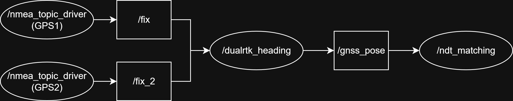

# GNSS-DualRTK-Heading

[中文版本](./README_zh-TW.md)  

This package uses **dual RTK-GPS antennas** to calculate heading, solving the problem where autonomous vehicles cannot automatically determine the facing direction at startup.  
It can be integrated with [GNSS-Localizer](../GNSS-Localizer) to establish a precise local coordinate system.

---

## Features
- Publishes `/heading`, `gnss_pose`, and related results for use with GNSS-Localizer, NDT-Matching, and other modules.  
- Works together with GNSS-Localizer to form a complete localization system: *precise local coordinates + heading*.

---

## RQT Graph


---

## Development Environment
- Ubuntu 18.04  
- ROS (Melodic)  
- C++17  
- CMake 3.10+  
- ROS packages: `roscpp`, `sensor_msgs`, `geometry_msgs`, `std_msgs`, `tf`  
- Runtime dependency: `nmea_navsat_driver`  

---

## Installation / Usage Example
```bash
cd ~/catkin_ws/src
git clone https://github.com/LeviChen1126/GNSS-DualRTK-Heading.git
cd ..
catkin_make
source devel/setup.bash
```

---

## Run
### 1. Start GPS drivers
```bash
roslaunch gnss_dualrtk_heading dual_gps_serial.launch port1:=/dev/ttyACM0 port2:=/dev/ttyACM1 baud:=19200
```

Or use rosbag / test mode:
```bash
roslaunch gnss_dualrtk_heading dual_gps_topic_test.launch
```

### 2. Start the Heading Node
```bash
roslaunch gnss_dualrtk_heading dualrtk_heading.launch
``` 

---

## Launch Files
- **dual_gps_serial.launch**: Starts two serial RTK-GPS devices simultaneously → `/fix`, `/fix_2`  
- **dual_gps_topic_test.launch**: Test mode without serial, runs only topic drivers  
- **dualrtk_heading.launch**: Starts the heading node and loads `gnss_dualrtk.yaml`  

---

## Project Structure
```
GNSS-DualRTK-Heading/
 ├── launch/
 │    ├── dualrtk_heading.launch
 │    ├── dual_gps_serial.launch
 │    └── dual_gps_topic_test.launch
 ├── config/
 │    └── gnss_dualrtk.yaml
 ├── src/
 │    └── dualrtk_heading_node.cpp
 ├── images/
 │    └── rqt_graph.jpg
 ├── .gitattributes
 ├── .gitignore
 ├── CMakeLists.txt
 ├── package.xml
 ├── README.md
 └── LICENSE
```

---

## License & Acknowledgment
- [MIT License](./LICENSE)  
- [Autoware](https://www.autoware.org/)  
